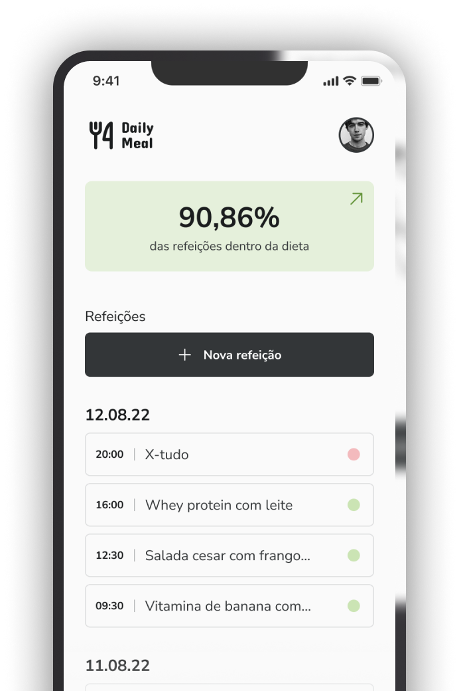
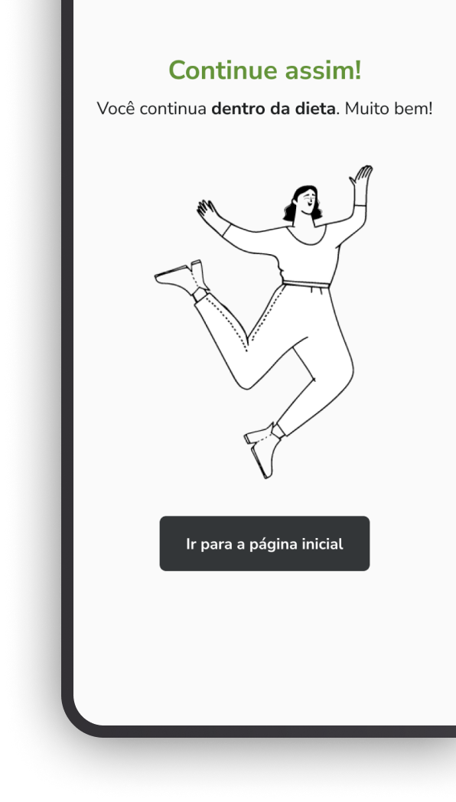

<h1 align="center">
    
    
</h1>

<h4 align="center"> 
	🚀Ignite React Native
</h4>

    
 
  

  <a href="#technologies">Technologies</a>&nbsp;&nbsp;&nbsp;|&nbsp;&nbsp;&nbsp;
  <a href="#information">About</a>&nbsp;&nbsp;&nbsp;

## ✏ About

This project is the second challenge of the 2022 ignite react track by [RocketSeat]. The project is a diet tracking app with React Native.

[Figma](<https://www.figma.com/file/6VwWgIBFib8XhN6W4GsZsu/Daily-Diet-•-Desafio-React-Native-(Community)-(Copy)?node-id=2%3A12&mode=dev>)

## 🛠 Technologies and Libs:

the following technologies and libs:

- [Expo]
- [Typescript]
- [AsyncStorage]
- [Uuidv4]
- [Phosphor-React-Native]
- [React-Native-Safe-Area-Context]
- [React-Native-Navigation]
- [Styled-Components]
- [React-Hook-Form]

Made with ♥ by Whey :wave: [Get in touch!](https://www.linkedin.com/in/wheyckson-lopes/)
